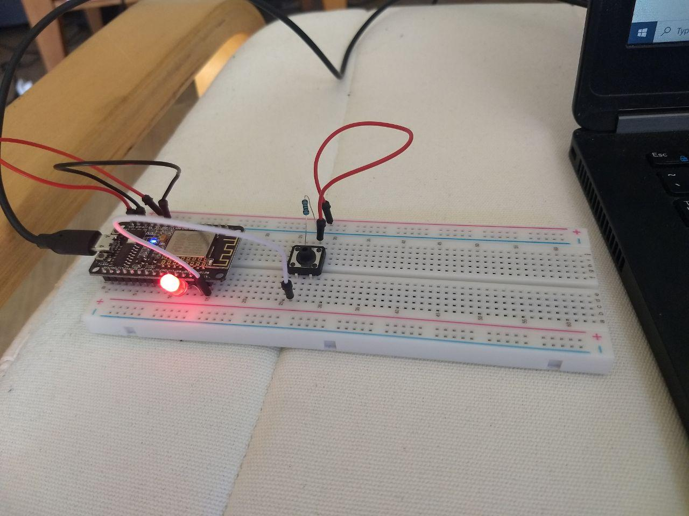
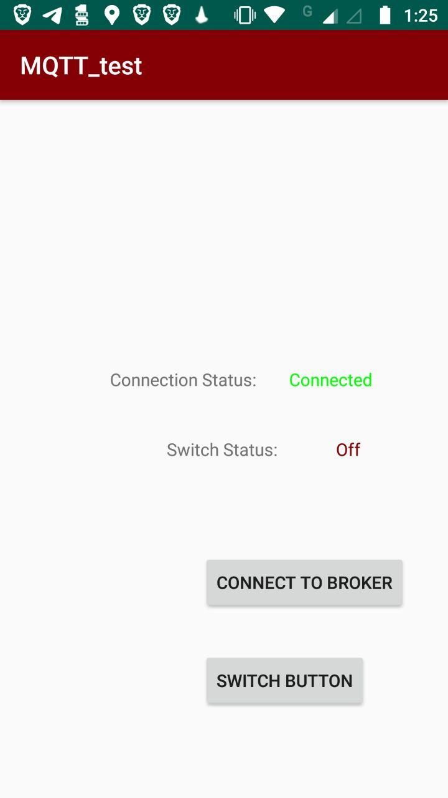

# Experiments with MQTT
For a while I've been meaning to tinker with MQTT and IOT in general. Although I've had a little exposure to the protocol in my work it's mostly been on the software integration side. I wanted to try to program some hardware, namely the very cool esp8266 development board.

## Setting up the MQTT broker
For those of you familiar with the MQTT protocol it requires a server side "broker" to handle incoming messages and outgoing messages. In my mind I like to think of it like a modern take on those old timey switch boards :)
Since the MQTT protocol is so light weight one of my raspberry pi's seemed like the perfect piece of hardware to act as my server broker.

I ssh'd onto one of my pi's, I happened to be lying in bed and I could use the juice app on my phone to establish a terminal window, and ran the following commands to get a Mosquitto mqtt broker up and running:
```sh
apt-get install mosquitto
mosquitto -d
```
I then did a quick test to check the broker was working:
I needed two terminal windows for this. In the first I ran the following commands:
```sh
apt-get install mosquitto-clients
mosquitto_sub -d -t testingtesting
```
In the second terminal window I ran this command:
```sh
mosquitto_pub -d -t testingtesting -m "Hello world!"
```
Great now onto the next step.

## Setting up the esp8266 board
I used the arduino IDE to write the code I used on my esp8266 board. There are plenty of tutorials out there on how to get the correct drivers and libraries to do this.
I decided to start off by controlling a single led via the "onoffswitch" MQTT channel. When the message "on" is sent the led should switch on and when "off" is sent then the led should turn off. Simple right :)
Here's a link to the code I used:
[esp8266 code](https://github.com/peader/PetesProjects/blob/master/mqtt_experiments/esp8266_lightswitch/esp8266Firmware/mqttfirmware/mqttfirmware.ino)

## Setting up the android app
I could have sent messages to my broker and thus my esp8266 board via command line in a terminal window like I did when testing the broker. I thought it would be cooler to try and build a little android app to do the same with a nice UI.
Android studio is super nice to work with and setup time for deploying an app to a phone is relatively short. Again there are plenty of resources out there describing how to do just that.
Here's a link to the code for the android app I built:
[android app](https://github.com/peader/PetesProjects/tree/master/mqtt_experiments/esp8266_lightswitch/androidClient)
A quick shout out to wildan2711 who's [mqtthelper](https://github.com/wildan2711/mqtt-android-tutorial/blob/master/app/src/main/java/helpers/MqttHelper.java) I modified for this project.

And there it is. A super overengineered light switch but a good basis for future IOT projects :)





